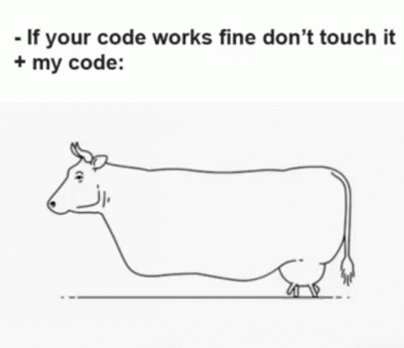

<h2 align="center"> Hi 👋 , I'm Woojin Jeong  </h2> 
   
  <!--     
  
  </h3> -->

<a src="https://tenor.com/view/do-not-touch-it-programmer-walking-cow-coding-gif-17252607">
<small>gif_source</small>
</a> 

 

-----------------------------
  

<h2 align="center">Languages & Technologies</h2> 

 

 

 

 

 

 

-------------------------------------------------------------------------

 

 ### ✨ I love coding + learning ✨ 

 
 
<h4> Contect </h4>

 

   

 
🌟 sTaTs 🌟

 

 

<!--  

	
	
---------------------------------------------------------------------------------------------------------------------------------------------------------------------------

 

	

 -->

------
Credit: [woobba94](https://github.com/woobba94)
Last Edited on: 11/11/2021